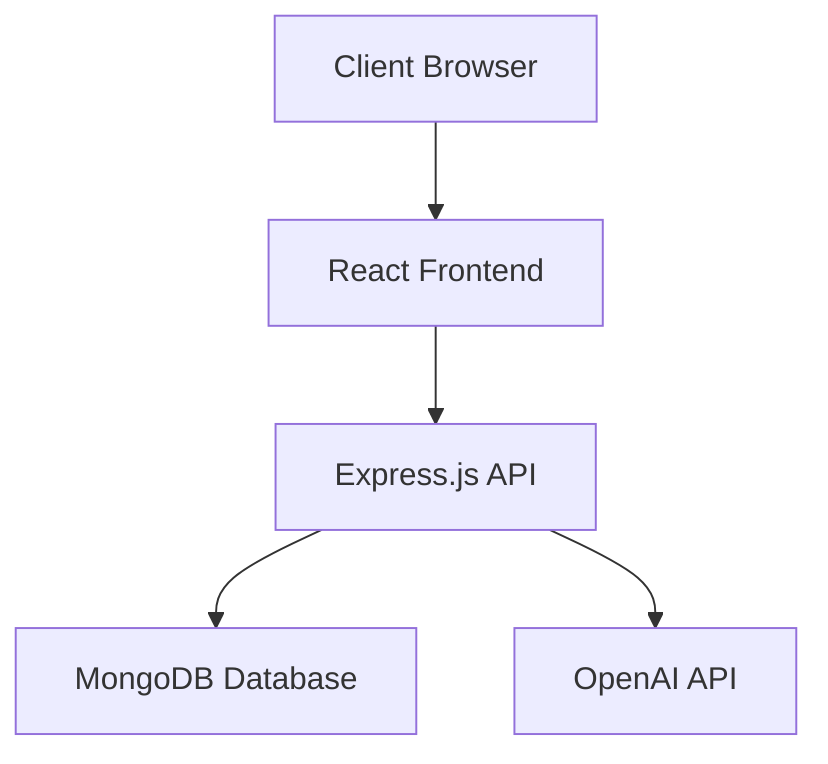
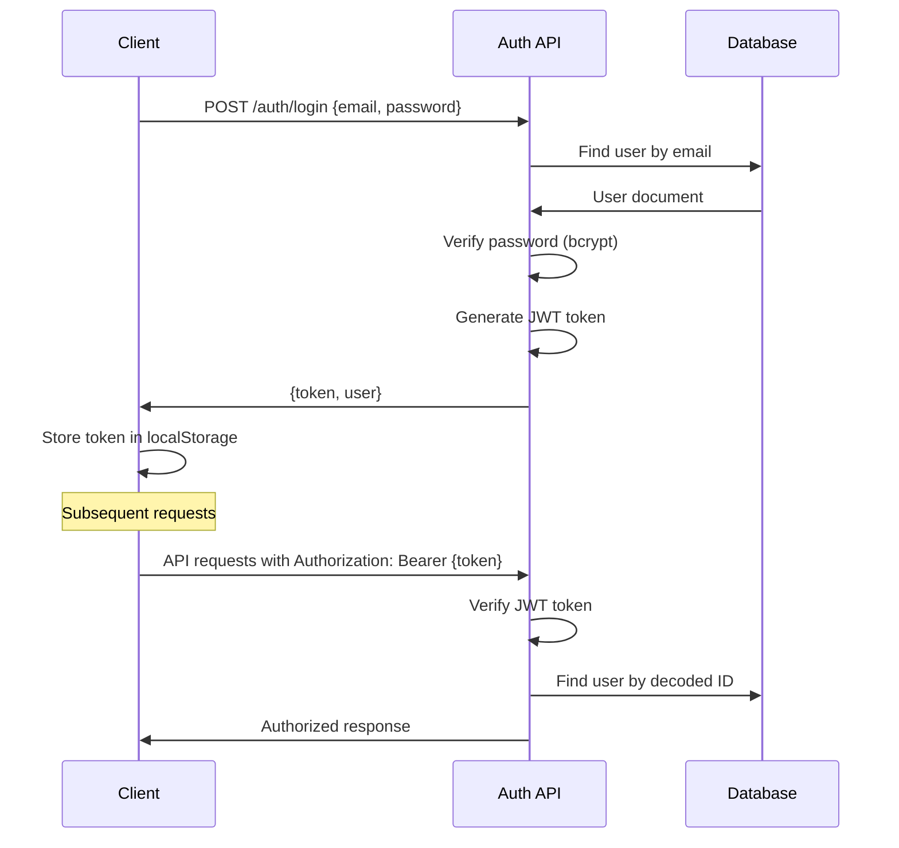
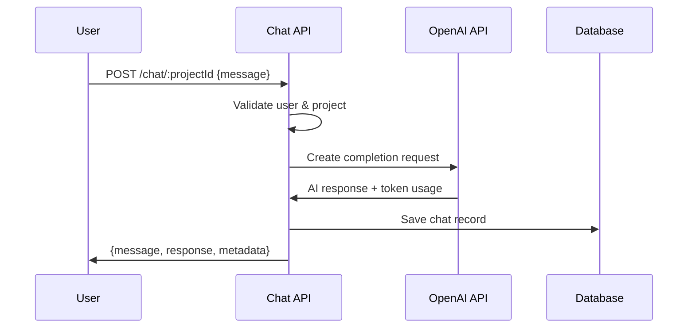

# Chatbot Platform Architecture

This document provides a comprehensive overview of the chatbot platform's architecture, design decisions, and system components.

## 📐 System Overview

The chatbot platform follows a **three-tier architecture** pattern:



## 🏗️ Architecture Layers

### 1. Presentation Layer (Frontend)
**Technology**: React 18 + TypeScript
**Port**: 3000 (development)

#### Components Structure
```
src/
├── components/          # UI Components
│   ├── Login.tsx       # Authentication form
│   ├── Register.tsx    # User registration
│   ├── Dashboard.tsx   # Project management
│   ├── ChatInterface.tsx # Main chat UI
│   ├── CreateProjectModal.tsx # Project creation
│   └── ProjectCard.tsx # Project display card
├── context/            # State Management
│   └── AuthContext.tsx # Global authentication state
├── services/           # API Integration
│   └── api.ts         # HTTP client configuration
└── types/             # TypeScript Definitions
    └── index.ts       # Shared interfaces
```

#### Key Features
- **Single Page Application (SPA)** with client-side routing
- **Context API** for global state management
- **Protected Routes** with authentication guards
- **Responsive Design** for mobile/desktop
- **Real-time UI Updates** for chat interface

### 2. Application Layer (Backend API)
**Technology**: Node.js + Express.js
**Port**: 5000 (development)

#### Service Architecture
```
backend/
├── server.js           # Application entry point
├── routes/            # API endpoint definitions
│   ├── auth.js       # Authentication endpoints
│   ├── projects.js   # Project CRUD operations  
│   └── chat.js       # Chat & AI integration
├── models/           # Data models
│   ├── User.js      # User schema & methods
│   ├── Project.js   # Project schema & methods
│   └── Chat.js      # Chat message schema
├── middleware/       # Express middleware
│   └── auth.js      # JWT authentication
└── validation/       # Input validation
    └── schemas.js   # Joi validation rules
```

#### API Design Principles
- **RESTful Architecture** with standard HTTP methods
- **JWT-based Authentication** with Bearer tokens
- **Input Validation** using Joi schemas
- **Error Handling** with consistent response formats
- **User Isolation** ensuring data security

### 3. Data Layer (Database)
**Technology**: MongoDB with Mongoose ODM

#### Data Models

```javascript
// User Model
{
  _id: ObjectId,
  username: String (unique),
  email: String (unique, indexed),
  password: String (bcrypt hashed),
  createdAt: Date,
  updatedAt: Date
}

// Project Model  
{
  _id: ObjectId,
  name: String,
  description: String,
  user: ObjectId (ref: User),
  config: {
    model: String,
    temperature: Number,
    maxTokens: Number
  },
  isActive: Boolean,
  createdAt: Date,
  updatedAt: Date
}

// Chat Model
{
  _id: ObjectId,
  project: ObjectId (ref: Project),
  user: ObjectId (ref: User),
  message: String,
  response: String,
  role: String (enum: 'user', 'assistant'),
  metadata: {
    tokens: Number,
    model: String
  },
  createdAt: Date,
  updatedAt: Date
}
```

#### Database Indexes
- `User.email` - Unique index for authentication
- `Project.user` - Compound index for user projects
- `Chat.project + Chat.createdAt` - Compound index for chat history

## 🔐 Security Architecture

### Authentication Flow


### Security Measures
- **Password Hashing**: bcrypt with 12 salt rounds
- **JWT Tokens**: Signed with secure secret, 1-hour expiration
- **Input Validation**: Joi schemas on all endpoints
- **User Isolation**: Database queries filtered by user ID
- **CORS Protection**: Configured for specific origins
- **Environment Variables**: Sensitive data in .env files

## 🤖 AI Integration Architecture

### OpenAI Integration Flow


### AI Configuration
- **Model**: GPT-3.5-turbo (configurable per project)
- **System Prompt**: Contextual assistant behavior
- **Temperature**: 0.7 (balanced creativity)
- **Max Tokens**: 50-150 (cost optimization)
- **Error Handling**: Graceful fallback for API failures

## 📊 Data Flow Architecture

### Request/Response Flow
```
Client Request → CORS → Route Handler → Auth Middleware → Validation → Business Logic → Database → Response
```

### State Management Flow
```
User Action → Component State → Context API → Local Storage → API Call → Database → Response → UI Update
```

## 🚀 Scalability Design

### Horizontal Scaling Considerations
- **Stateless API**: JWT tokens eliminate session storage
- **Database Sharding**: User-based partitioning ready
- **Load Balancing**: Express app supports multiple instances
- **Caching Layer**: Redis integration ready for sessions

### Performance Optimizations
- **Database Indexes**: Optimized for common queries
- **Pagination**: Limited results (50 chat messages)
- **Connection Pooling**: Mongoose connection management
- **Token Usage Tracking**: Cost monitoring and limits

## 🔧 Configuration Management

### Environment Variables
```bash
# Database Configuration
MONGODB_URI=mongodb://localhost:27017/chatbot

# Authentication
JWT_SECRET=your-jwt-secret-key

# External Services  
OPENAI_API_KEY=your-openai-api-key

# Server Configuration
PORT=5000
NODE_ENV=development
```

### Configuration Layers
1. **Default Values**: Hardcoded fallbacks in code
2. **Environment Variables**: Runtime configuration
3. **Project Config**: Per-project AI settings
4. **User Preferences**: Future user customization

## 📈 Monitoring & Logging

### Logging Strategy
- **Development**: Console logging with request details
- **Production**: Structured logging with log levels
- **Error Tracking**: Exception handling and reporting
- **Performance Metrics**: Response times and token usage

### Health Monitoring
- **Database Connection**: MongoDB connection status
- **External APIs**: OpenAI service availability
- **Authentication**: JWT token validation rates
- **Usage Metrics**: Token consumption tracking

## 🔄 Development Workflow

### API Development Pattern
1. **Model Definition**: Define Mongoose schema
2. **Route Creation**: Implement REST endpoints
3. **Validation**: Add Joi input validation
4. **Testing**: Unit and integration tests
5. **Documentation**: API documentation updates

### Frontend Development Pattern
1. **Component Design**: Create reusable components
2. **State Management**: Integrate with Context API
3. **API Integration**: Connect to backend services
4. **UI/UX**: Responsive design implementation
5. **Testing**: Component and integration testing

## 🚦 Error Handling Strategy

### API Error Responses
```javascript
{
  success: false,
  error: "Descriptive error message",
  code: "ERROR_CODE", // Optional
  details: {} // Optional debug info
}
```

### Frontend Error Handling
- **Network Errors**: Retry logic with exponential backoff
- **Authentication Errors**: Automatic token refresh/logout
- **Validation Errors**: User-friendly form feedback
- **Runtime Errors**: Error boundaries with fallback UI

## 🔮 Future Architecture Considerations

### Planned Enhancements
- **Microservices**: Split into auth, chat, and project services
- **Message Queue**: Redis/RabbitMQ for async processing
- **WebSocket**: Real-time chat updates
- **CDN Integration**: Static asset optimization
- **Analytics Service**: User behavior and usage analytics

### Scalability Roadmap
- **Container Orchestration**: Docker + Kubernetes deployment
- **Database Clustering**: MongoDB replica sets
- **API Gateway**: Rate limiting and routing
- **Caching Layer**: Redis for session and response caching

---

This architecture provides a solid foundation for a scalable, secure, and maintainable chatbot platform while remaining flexible for future enhancements and integrations.